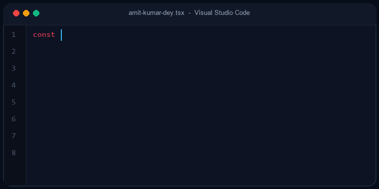

  # 👋 Hi, I'm Amit Kumar Dey

  

   

  

    

  

    
    
    
    
  

---

## 👨‍💻 About Me

I am a passionate **Frontend Developer** with over **3 years of hands-on experience** building responsive, user-friendly, and maintainable web applications. My specialty lies in engineering modular, scalable frontends using the modern **React.js, Next.js, and TypeScript** ecosystem, paired with robust state management and seamless REST API integrations.

- 🔭 **Currently Building**: Scalable web applications leveraging **Next.js (App Router), React, TypeScript, and MongoDB**
- 🌱 **Actively Exploring**: Backend development, API design, web performance, and modern application architecture
- 💼 **Industry Focus**: Clean code, modular component architecture, type safety, and responsive UI design
- 💬 **Ask Me About**: React.js, Next.js, TypeScript, Redux Toolkit, Tailwind CSS, and REST API integration
- 🤝 **Open For**: Frontend Developer opportunities, challenging projects, and tech collaborations

---

## 🛠️ Tech Stack & Skills

  

 

| Domain | Technologies |
| :--- | :--- |
| **Frontend Development** | `React.js` · `Next.js` · `TypeScript` · `JavaScript (ES6+)` · `Redux Toolkit` · `Tailwind CSS` · `Bootstrap` · `Material UI` · `HTML5 / CSS3` |
| **Backend & Databases** | `Node.js` · `Express.js` · `RESTful APIs` · `MongoDB` · `Mongoose` · `JWT Authentication` |
| **Tools & Platforms** | `Git` · `GitHub` · `Bitbucket` · `Postman` · `VS Code` · `Vercel` · `Jira` · `Agile / Scrum` |

---

## 🚀 Featured Projects

<table>
  <tr>
    <td width="50%" valign="top">
      <h3>🌐 <a href="https://amitkumar-dey.vercel.app">Portfolio CMS</a></h3>
      
A modern portfolio application built with Next.js and TypeScript, featuring dynamic content management, MongoDB integration, authentication, and an administrative dashboard.

      

        
        
        
        
      

      

        <a href="https://amitkumar-dey.vercel.app"><b>🔗 Live Demo</b></a> &nbsp;|&nbsp; <em>🔒 Private Repository</em>
      

    </td>
    <td width="50%" valign="top">
      <h3>👥 <a href="https://github.com/AmitKumarDe/user-management-system">User Management System</a></h3>
      
A production-ready REST API demonstrating complete user lifecycle management with CRUD operations, pagination, search, schema validation with Zod, and role-based access.

      

        
        
        
        
      

      

        <a href="https://github.com/AmitKumarDe/user-management-system"><b>💻 Source Code</b></a>
      

    </td>
  </tr>
  <tr>
    <td width="50%" valign="top">
      <h3>🔐 <a href="https://github.com/AmitKumarDe/jwt-authentication-system">JWT Authentication System</a></h3>
      
An authentication-focused backend project featuring access and refresh tokens, bcrypt password hashing, protected routes, and secure cookie handling.

      

        
        
        
        
      

      

        <a href="https://github.com/AmitKumarDe/jwt-authentication-system"><b>💻 Source Code</b></a>
      

    </td>
    <td width="50%" valign="top">
      <h3>🍹 <a href="https://github.com/AmitKumarDe/CocktailDB_API">Cocktail Explorer App</a></h3>
      
A responsive cocktail recipe discovery application featuring third-party API integration, dynamic search & filtering, client-side routing, and responsive UI design.

      

        
        
        
        
      

      

        <a href="https://github.com/AmitKumarDe/CocktailDB_API"><b>💻 Source Code</b></a>
      

    </td>
  </tr>
  <tr>
    <td colspan="2" valign="top">
      <h3>💬 <a href="https://github.com/AmitKumarDe/Random-Quote-Generator">Random Quote Generator</a></h3>
      
A responsive React web app integrating public quote APIs with Material UI components, asynchronous state handling, and interactive user controls.

      

        
        
        
        
      

      

        <a href="https://github.com/AmitKumarDe/Random-Quote-Generator"><b>💻 Source Code</b></a>
      

    </td>
  </tr>
</table>

---

## 📊 GitHub Analytics

  
  
    
  

---

## 🤝 Connect With Me

  
  &nbsp;
  
  &nbsp;
  
  &nbsp;
  

---

  
⭐ <b>If you find my projects useful, consider giving them a star!</b>

  
<i>"Crafting seamless, elegant, and modern web experiences with code."</i>

